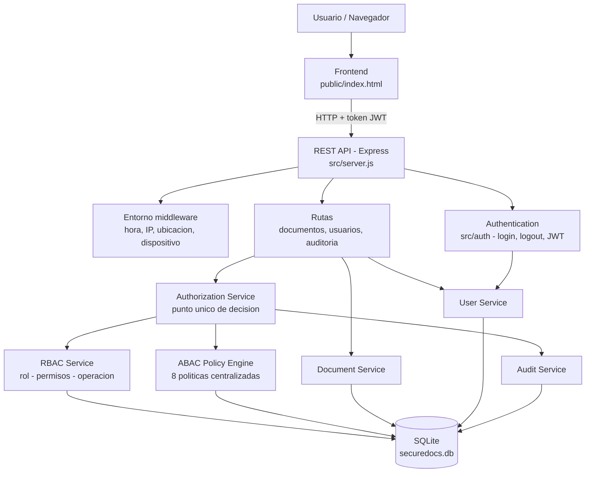
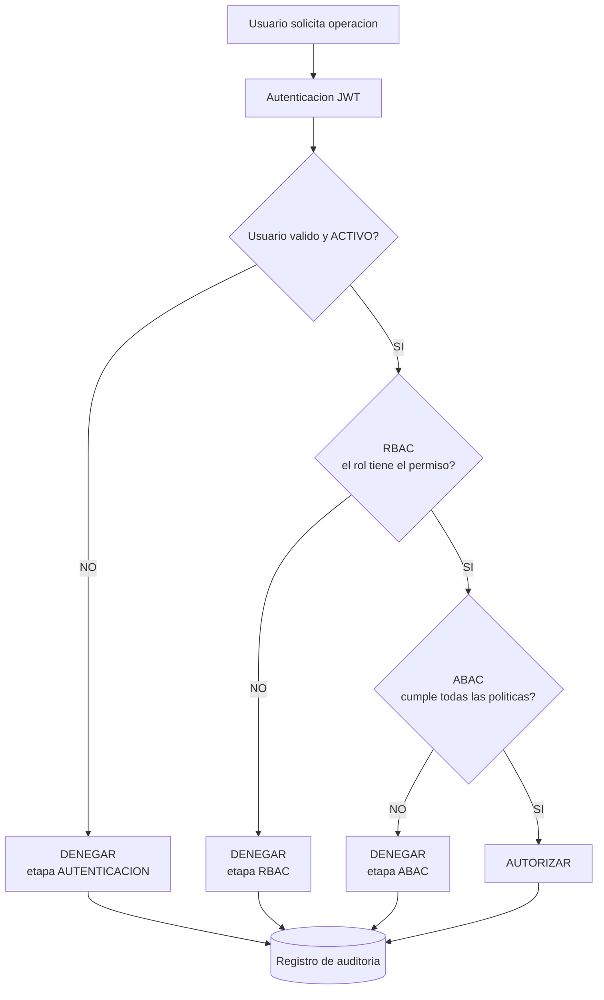
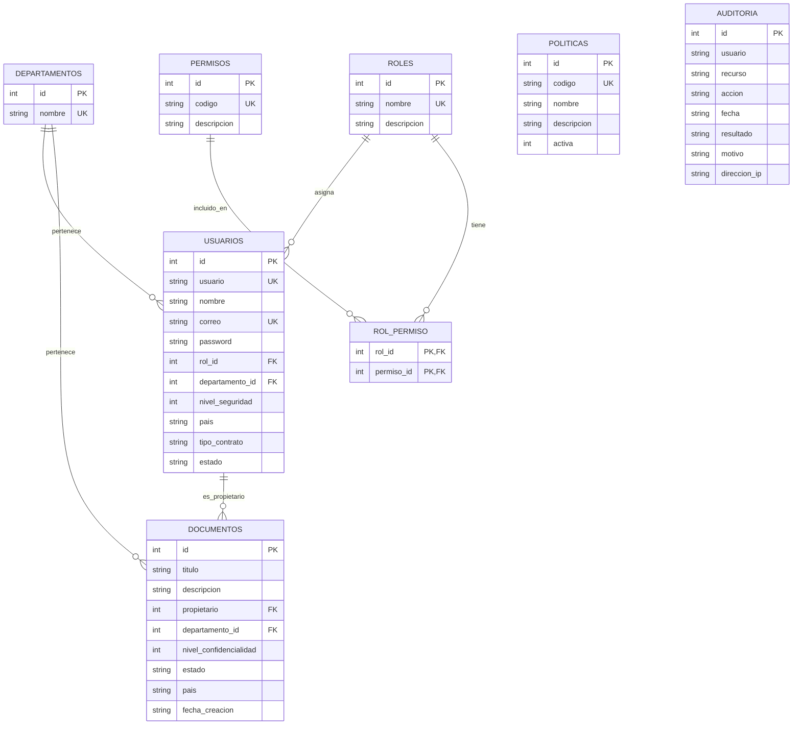
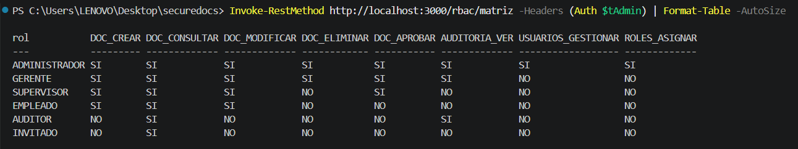
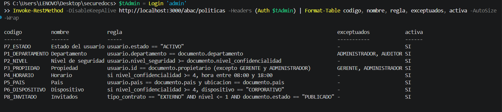
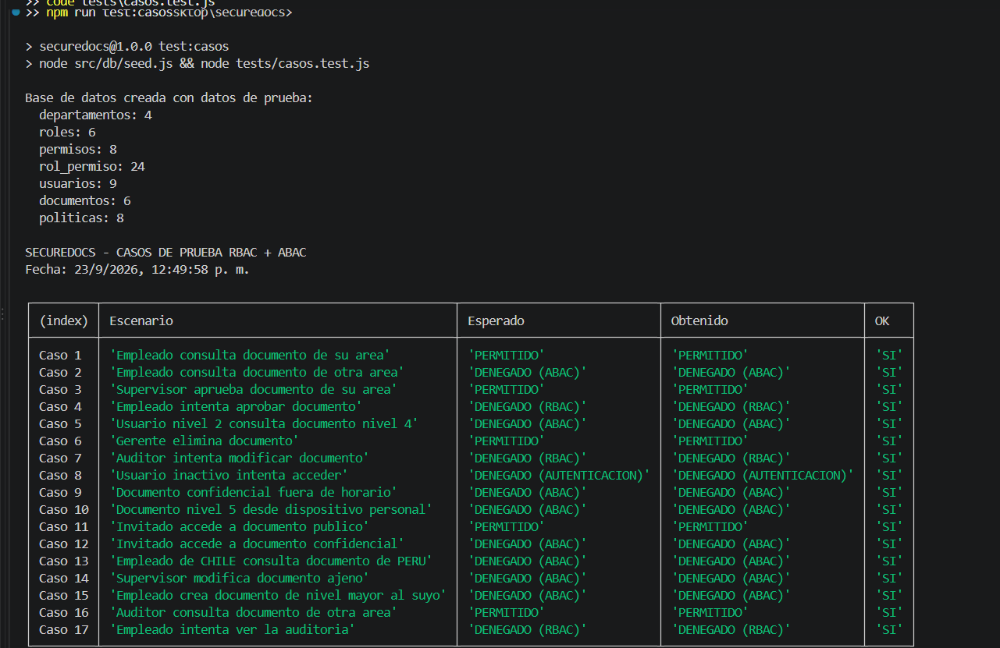

# SecureDocs - Sistema de Gestion de Expedientes con RBAC y ABAC

Laboratorio de **Cloud Security - Seguridad en la nube** (Tecsup).

SecureDocs es una API REST para administrar documentos y expedientes de la empresa ficticia **TechCorp S.A.** La autorizacion se hace en dos etapas:

- **RBAC (Role-Based Access Control):** que puede hacer un usuario por su rol.
- **ABAC (Attribute-Based Access Control):** si puede hacerlo en estas condiciones especificas (departamento, nivel de seguridad, pais, hora, dispositivo, estado, etc.).

El acceso solo se permite cuando **RBAC = PERMITIDO y ABAC = PERMITIDO**. Cada intento queda registrado en la auditoria.

---

## Integrantes

| Nombre | Rol en el proyecto |
|---|---|
| Junior | Desarrollo backend, RBAC, ABAC, pruebas |


---

## Tecnologias

| Capa | Tecnologia |
|---|---|
| Backend | Node.js 24 + Express 5 |
| Autenticacion | JWT (jsonwebtoken) + bcryptjs |
| Base de datos | SQLite (modulo nativo `node:sqlite`) |
| Frontend | HTML + Bootstrap (carpeta `public`) |
| Pruebas | Script Node.js con `fetch` (17 casos) |

---

## Instalacion

### Requisitos

- Node.js 22.13 o superior (probado con Node.js 24)
- Git

### Pasos

```bash
# 1. Clonar el repositorio
git clone https://github.com/juniorcueva-star/semana_5_nuve_Cloud-Security.git
cd semana_5_nuve_Cloud-Security

# 2. Instalar dependencias
npm install

# 3. Crear el archivo de configuracion a partir del ejemplo
#    Windows PowerShell:
Copy-Item .env.example .env
#    Linux / Mac:
cp .env.example .env

# 4. Crear la base de datos con los datos de prueba
npm run seed

# 5. Levantar el servidor
npm run dev
```

El servidor queda disponible en `http://localhost:3000`.

### Comandos disponibles

| Comando | Descripcion |
|---|---|
| `npm run dev` | Inicia el servidor y lo reinicia al guardar cambios |
| `npm start` | Inicia el servidor en modo normal |
| `npm run seed` | Borra y vuelve a crear los datos de prueba |
| `npm run test:casos` | Ejecuta los 17 casos de prueba (el servidor debe estar corriendo) |

### Usuarios de prueba

Todos usan la contrasena `123456`.

| Usuario | Rol | Departamento | Nivel | Pais | Contrato | Estado |
|---|---|---|---|---|---|---|
| admin | ADMINISTRADOR | TI | 5 | PERU | INTERNO | ACTIVO |
| rosa.diaz | GERENTE | FINANZAS | 5 | PERU | INTERNO | ACTIVO |
| carlos.ruiz | SUPERVISOR | FINANZAS | 3 | PERU | INTERNO | ACTIVO |
| luis.perez | EMPLEADO | FINANZAS | 2 | PERU | INTERNO | ACTIVO |
| maria.lopez | EMPLEADO | RRHH | 2 | PERU | INTERNO | ACTIVO |
| jorge.vega | AUDITOR | AUDITORIA | 4 | PERU | INTERNO | ACTIVO |
| invitado.ext | INVITADO | FINANZAS | 1 | PERU | EXTERNO | ACTIVO |
| sofia.inactiva | EMPLEADO | FINANZAS | 2 | PERU | INTERNO | INACTIVO |
| diego.chile | EMPLEADO | FINANZAS | 3 | CHILE | INTERNO | ACTIVO |

---

## Diagrama de arquitectura



### Flujo de autorizacion (punto 7 del laboratorio)



### Estructura del proyecto

```
securedocs/
├── src/
│   ├── server.js                         # Punto de entrada
│   ├── db/
│   │   ├── database.js                   # Conexion y creacion de tablas
│   │   └── seed.js                       # Datos de prueba y matriz RBAC
│   ├── auth/                             # AUTHENTICATION
│   │   ├── auth.service.js               # Login, JWT, logout
│   │   └── auth.middleware.js            # Verifica el token en cada peticion
│   ├── authorization/                    # AUTHORIZATION
│   │   ├── acciones.js                   # Catalogo de acciones -> permiso
│   │   ├── authorization.service.js      # Decision final RBAC + ABAC
│   │   ├── authorize.middleware.js       # Guardias para las rutas
│   │   ├── rbac/
│   │   │   └── rbac.service.js           # Motor RBAC
│   │   └── abac/
│   │       ├── politicas.js              # Las 8 politicas (centralizadas)
│   │       ├── abac.engine.js            # Motor ABAC
│   │       └── entorno.middleware.js     # Atributos del entorno
│   ├── services/                         # Acceso a datos
│   │   ├── usuario.service.js
│   │   ├── documento.service.js
│   │   └── auditoria.service.js
│   └── routes/                           # Endpoints REST
│       ├── auth.routes.js
│       ├── rbac.routes.js
│       ├── abac.routes.js
│       ├── documentos.routes.js
│       ├── usuarios.routes.js
│       └── auditoria.routes.js
├── public/                               # Frontend
├── tests/
│   └── casos.test.js                     # 17 casos de prueba
└── docs/
    └── evidencias/                       # Capturas y resultados
```

Ninguna ruta contiene condicionales del tipo `if (rol == "ADMIN")`. Cada ruta declara la accion que necesita, por ejemplo `requierePermisoSobreDocumento('UPDATE')`, y el motor de autorizacion decide (punto 16 del laboratorio).

---

## Modelo de base de datos



Restricciones principales (CHECK en la base de datos):

- `nivel_seguridad` y `nivel_confidencialidad`: de 1 a 5
- `tipo_contrato`: INTERNO o EXTERNO
- `usuarios.estado`: ACTIVO, INACTIVO o SUSPENDIDO
- `documentos.estado`: BORRADOR, PENDIENTE, APROBADO o PUBLICADO

---

## Matriz de roles y permisos RBAC

Se guarda en la tabla `rol_permiso`. Para cambiar un permiso no se modifica el codigo, solo la base de datos.

| Operacion | Permiso | Administrador | Gerente | Supervisor | Empleado | Auditor | Invitado |
|---|---|---|---|---|---|---|---|
| Crear documento | DOC_CREAR | SI | SI | SI | SI | NO | NO |
| Consultar documento | DOC_CONSULTAR | SI | SI | SI | SI | SI | SI |
| Modificar documento | DOC_MODIFICAR | SI | SI | SI | SI | NO | NO |
| Eliminar documento | DOC_ELIMINAR | SI | SI | NO | NO | NO | NO |
| Aprobar documento | DOC_APROBAR | SI | SI | SI | NO | NO | NO |
| Ver auditoria | AUDITORIA_VER | SI | SI | NO | NO | SI | NO |
| Gestionar usuarios | USUARIOS_GESTIONAR | SI | NO | NO | NO | NO | NO |
| Asignar roles | ROLES_ASIGNAR | SI | NO | NO | NO | NO | NO |

Evidencia obtenida del sistema (`GET /rbac/matriz`):



---

## Matriz de politicas ABAC

Todas las politicas estan en un solo archivo: `src/authorization/abac/politicas.js`. Cada una se puede activar o desactivar desde la tabla `politicas` (endpoint `PATCH /abac/politicas/:codigo`) sin tocar el codigo.

| Codigo | Politica | Regla | Acciones | Exceptuados | Se activa cuando |
|---|---|---|---|---|---|
| P1_DEPARTAMENTO | Departamento | usuario.departamento == documento.departamento | Todas las de documentos | ADMINISTRADOR, AUDITOR | Siempre |
| P2_NIVEL | Nivel de seguridad | usuario.nivel_seguridad >= documento.nivel_confidencialidad | Todas las de documentos | - | Siempre |
| P3_PROPIEDAD | Propiedad | usuario.id == documento.propietario | UPDATE | GERENTE, ADMINISTRADOR | Siempre |
| P4_HORARIO | Horario | hora entre 08:00 y 18:00 | Todas las de documentos | - | nivel >= 4 |
| P5_PAIS | Pais | usuario.pais == documento.pais y ubicacion == documento.pais | Todas las de documentos | - | Siempre |
| P6_DISPOSITIVO | Dispositivo | dispositivo == CORPORATIVO | Todas las de documentos | - | nivel >= 4 |
| P7_ESTADO | Estado del usuario | usuario.estado == ACTIVO | TODAS | - | Siempre |
| P8_INVITADO | Invitados | EXTERNO AND nivel <= 1 AND estado == PUBLICADO | Todas las de documentos | - | rol == INVITADO |

Acciones de documentos: CREATE, READ, UPDATE, DELETE, APPROVE.

Evidencia obtenida del sistema (`GET /abac/politicas`):



### Atributos del entorno

En un sistema real la ubicacion saldria de la IP y el tipo de dispositivo de una herramienta MDM. En este laboratorio se envian por cabeceras HTTP para poder simular los casos de prueba:

| Cabecera | Ejemplo | Uso |
|---|---|---|
| `X-Ubicacion` | PERU | Politica P5 |
| `X-Dispositivo` | CORPORATIVO o PERSONAL | Politica P6 |
| `X-Hora` | 20:30 | Politica P4 (opcional; si no se envia se usa la hora real) |

---

## API

Todos los endpoints, excepto el login, requieren la cabecera `Authorization: Bearer <token>`.

| Metodo | Ruta | Accion evaluada | Descripcion |
|---|---|---|---|
| POST | /auth/login | - | Iniciar sesion, devuelve el token JWT |
| POST | /auth/logout | - | Cerrar sesion (anula el token) |
| GET | /auth/me | - | Usuario autenticado |
| GET | /usuarios | MANAGE_USERS | Listar usuarios |
| POST | /usuarios | MANAGE_USERS + ASSIGN_ROLES | Registrar usuario |
| PUT | /usuarios/{id} | MANAGE_USERS (+ ASSIGN_ROLES si cambia el rol) | Modificar, activar o desactivar, asignar rol, departamento o nivel |
| GET | /documentos | READ (filtrado por ABAC) | Lista solo los documentos que el usuario puede ver |
| GET | /documentos/{id} | READ | Consultar documento |
| POST | /documentos | CREATE | Crear documento |
| PUT | /documentos/{id} | UPDATE | Modificar documento |
| DELETE | /documentos/{id} | DELETE | Eliminar documento |
| POST | /documentos/{id}/aprobar | APPROVE | Aprobar documento pendiente |
| GET | /auditoria | VIEW_AUDIT | Registro de auditoria (filtros: usuario, resultado, accion, limite) |
| GET | /rbac/mis-permisos | - | Permisos del usuario autenticado |
| GET | /rbac/matriz | ASSIGN_ROLES | Matriz RBAC completa |
| GET | /abac/politicas | - | Matriz de politicas ABAC |
| PATCH | /abac/politicas/{codigo} | ASSIGN_ROLES | Activar o desactivar una politica |
| POST | /abac/simular | la accion enviada | Evalua RBAC + ABAC y muestra el detalle de cada politica |

Ejemplo de respuesta de acceso denegado:

```json
{
  "error": "ACCESO DENEGADO",
  "etapa": "ABAC",
  "motivo": "P1_DEPARTAMENTO (Departamento: RRHH != FINANZAS); P2_NIVEL (Nivel: 2 < 3)",
  "politicas": [
    { "politica": "P7_ESTADO", "cumple": true, "detalle": "Estado del usuario: ACTIVO" },
    { "politica": "P1_DEPARTAMENTO", "cumple": false, "detalle": "Departamento: RRHH != FINANZAS" },
    { "politica": "P2_NIVEL", "cumple": false, "detalle": "Nivel: 2 < 3" }
  ]
}
```

---

## Casos de prueba

Se ejecutan todos juntos con `npm run test:casos`. El script reinicia la base de datos, llama a la API real y compara el resultado esperado con el obtenido. El detalle con el motivo de cada decision se guarda en [docs/evidencias/resultados_pruebas.md](docs/evidencias/resultados_pruebas.md).

### 12 casos obligatorios

| # | Escenario | Resultado esperado | Politica o regla |
|---|---|---|---|
| 1 | Empleado consulta documento de su area | Permitido | RBAC + ABAC OK |
| 2 | Empleado consulta documento de otra area | Denegado por ABAC | P1 Departamento |
| 3 | Supervisor aprueba documento de su area | Permitido | RBAC + ABAC OK |
| 4 | Empleado intenta aprobar documento | Denegado por RBAC | Sin DOC_APROBAR |
| 5 | Usuario nivel 2 consulta documento nivel 4 | Denegado por ABAC | P2 Nivel |
| 6 | Gerente elimina documento | Permitido | RBAC + ABAC OK |
| 7 | Auditor intenta modificar documento | Denegado por RBAC | Sin DOC_MODIFICAR |
| 8 | Usuario inactivo intenta acceder | Denegado | Autenticacion y P7 Estado |
| 9 | Documento confidencial accedido fuera de horario | Denegado por ABAC | P4 Horario |
| 10 | Documento nivel 5 accedido desde dispositivo personal | Denegado por ABAC | P6 Dispositivo |
| 11 | Invitado accede a documento publico | Permitido | P8 Invitado OK |
| 12 | Invitado accede a documento confidencial | Denegado por ABAC | P2 Nivel y P8 Invitado |

### 5 casos adicionales del grupo

| # | Escenario | Resultado esperado | Politica o regla |
|---|---|---|---|
| 13 | Empleado de CHILE consulta documento de PERU | Denegado por ABAC | P5 Pais |
| 14 | Supervisor modifica un documento ajeno | Denegado por ABAC | P3 Propiedad |
| 15 | Empleado crea un documento de nivel mayor al suyo | Denegado por ABAC | P2 Nivel al crear |
| 16 | Auditor consulta un documento de otra area | Permitido | Excepcion de P1 para AUDITOR |
| 17 | Empleado intenta ver la auditoria | Denegado por RBAC | Sin AUDITORIA_VER |

Resultado obtenido: **17 de 17 casos correctos**.



---

## Registro de auditoria

Cada intento de acceso, permitido o denegado, se guarda en la tabla `auditoria` con: quien hizo la solicitud, que recurso pidio, que operacion intento, fecha y hora, resultado y motivo.

Ejemplo de registro:

```json
{
  "usuario": "carlos.ruiz",
  "recurso": "documento-2",
  "accion": "UPDATE",
  "fecha": "2026-09-23 12:55:39",
  "resultado": "DENEGADO",
  "motivo": "ABAC: P3_PROPIEDAD (Propiedad: usuario 3 != propietario 4)"
}
```


Registro completo exportado: [docs/evidencias/auditoria_completa.csv](docs/evidencias/auditoria_completa.csv)